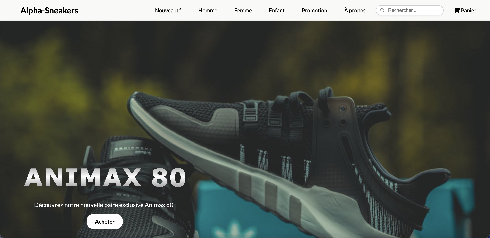
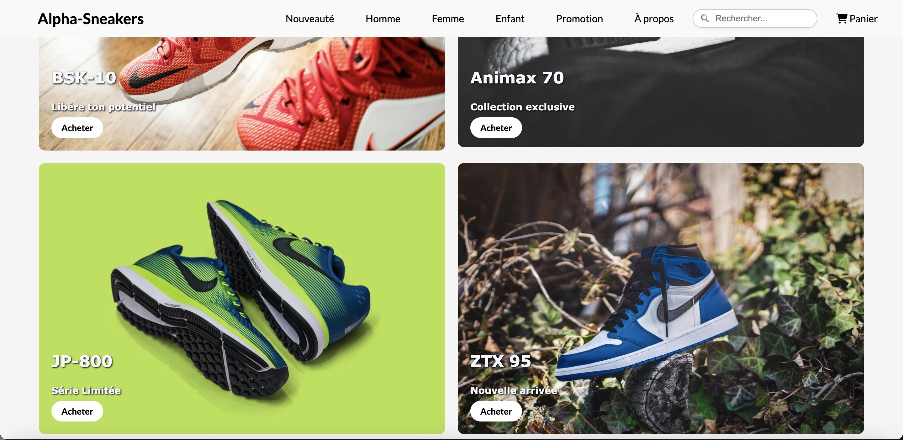
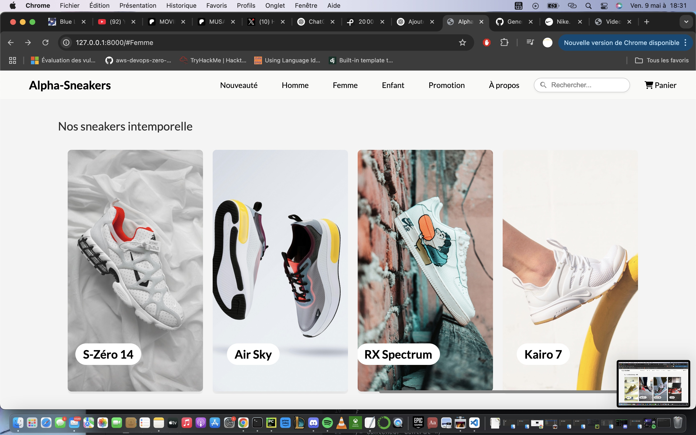
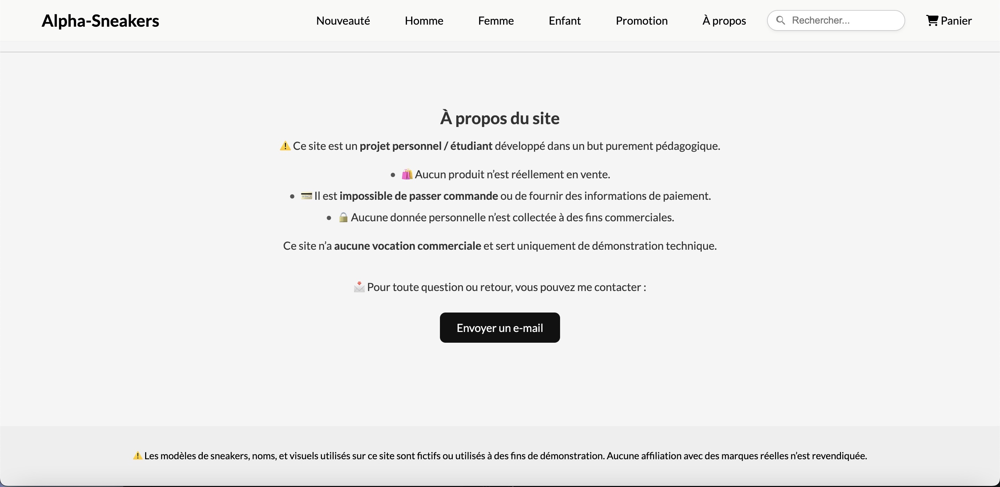

# 👟 Alpha Sneakers

**Alpha Sneakers** est un site vitrine de sneakers développé pour mon portfolio.  
Ce projet met en avant mes compétences en intégration web, structuration de code et gestion de version.

> 🛑 Le site n’est pas encore en ligne. Il est en cours de finalisation locale.

---

## 📄 Fonctionnalités du site

- Page d’accueil avec mise en page professionnelle  
- Navigation responsive (adaptée aux mobiles/tablettes)  
- Formulaire de recherche intégré  
- Section À propos  
- Section contact avec bouton d'action  
- panier (fictif)  
- Design clair, structuré et adaptable  
- Organisation rigoureuse du code  

---

## 🖼 Aperçu du site

 





---
## 🖥️ Technologies utilisées

- HTML5  
- CSS3  
- Git (versioning)  
- GitHub (hébergement du code)  

---

## 📁 Structure du projet

```text
├── LICENSE.txt
├── README.md
├── article
│   ├── __init__.py
│   ├── admin.py
│   ├── apps.py
│   ├── migrations
│   │   ├── 0001_initial.py
│   │   └── __init__.py
│   ├── models.py
│   ├── tests.py
│   ├── urls.py
│   └── views.py
├── manage.py
└── sneakers
    ├── __init__.py
    ├── asgi.py
    ├── settings.py
    ├── static
    │   ├── css
    │   │   ├── contact.css
    │   │   ├── image.css
    │   │   ├── search.css
    │   │   └── style.css
    │   └── images
    │       ├── Air Sky.jpg
    │       ├── Neo Cruze.jpg
    │       ├── RX Spider.jpg
    │       ├── RX spectrum.jpg
    │       ├── Subzéro-1000.jpg
    │       ├── Super Nova.jpg
    │       ├── Vector.jpg
    │       ├── airmin.jpg
    │       ├── animax.jpg
    │       ├── animax2.jpg
    │       ├── bsk-10.jpg
    │       ├── jp-800.jpg
    │       ├── velvet-700.jpg
    │       ├── vortex.jpg
    │       └── ztx 95.jpg
    ├── templates
    │   ├── base.html
    │   ├── cart.html
    │   ├── checkout.html
    │   └── index.html
    ├── urls.py
    ├── views.py
    └── wsgi.py
```
---

## 📜 Licence

Ce projet est sous licence [Creative Commons Attribution-NonCommercial 4.0 International](LICENSE.txt).

---

## 📫 Me contacter

Si vous avez des questions ou souhaitez me proposer une opportunité :

- **Email** : alphadu92@live.fr  
- **GitHub** : [AlphaBDiaby](https://github.com/AlphaBDiaby)